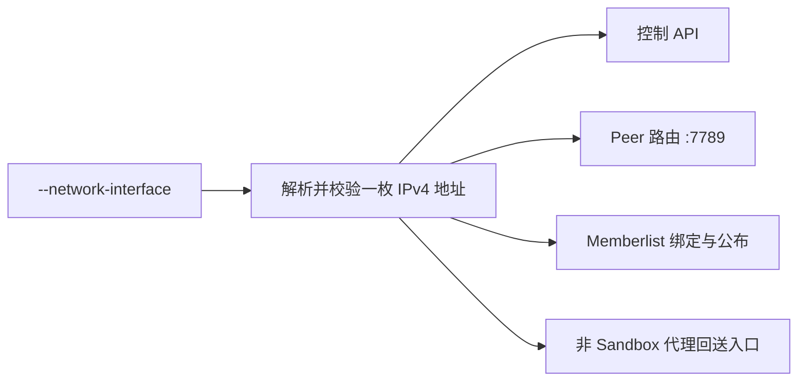
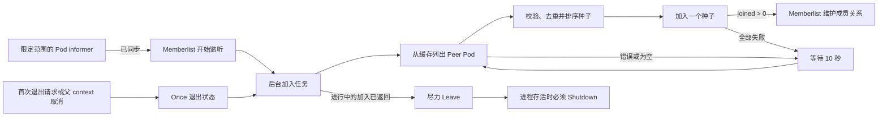

# Sandbox Manager 用户网卡绑定与可靠 Peer 发现

## 摘要

Sandbox Manager 增加可选参数 `--network-interface`。设置该参数后，进程从指定
网卡解析并校验出一枚 IPv4 地址，作为控制 API、peer 路由服务、memberlist 以及
非 Sandbox 代理请求本地回送入口共同使用的用户侧地址。参数为空时，保留原有
非托管网络行为。

Peer 发现复用现有 controller-runtime 缓存，并按系统命名空间和 peer 标签选择器
限制范围。Sandbox Manager 在创建 memberlist 前启动并同步缓存。memberlist 开始
监听后，种子发现和加入在后台持续重试。关闭时停止新的发现和重试，正在进行的加入
按其网络 deadline 返回。Once 退出状态把 Leave 和 Shutdown 交给唯一的生命周期
所有者，避免并发清理路径；短暂找不到 peer 不会阻塞控制 API。

## 背景

托管 Sandbox Manager Pod 同时连接平台网络和用户网络。所有承载或公布用户集群
流量的端点必须一致使用用户网络；如果不同协议选择了不同本地地址，进程可能在
一个协议上可达、在另一个协议上却与集群隔离。

各个 peer Pod 也会独立启动和停止。一次性的 Kubernetes 列表读取或单次同步加入
会把正常的启动先后顺序变成永久隔离。因此，可靠发现需要一份经过过滤且已同步的
本地 Pod 视图，以及一套不影响 API 就绪状态的后台重试生命周期。

## 设计终态

### 唯一的用户侧地址

`--network-interface` 遵循以下契约：

- 参数为空时保留既有非托管行为：控制 API 和 peer 路由服务监听所有本地地址；
  memberlist 优先使用 `POD_IP`，否则使用第一枚非 loopback IPv4 地址；非 Sandbox
  请求的代理回送入口继续使用 loopback。
- 参数非空时，其值是操作系统中的精确网卡名。该网卡必须存在、处于启用状态，
  且恰好拥有一枚全局单播 IPv4 地址。网卡不存在、未启用、没有地址或存在多枚
  地址时，进程启动失败，不能静默回退到其他网卡。
- 地址只在启动时解析和校验一次。地址变化通过重启进程生效。
- 控制 API listener、`7789` peer 路由 listener，以及 memberlist 的绑定地址和
  对外公布地址共同使用这枚地址。非 Sandbox 请求的代理回送入口也使用该地址，
  避免 listener 移到用户网络后，回送流量仍被静默导向 loopback。
- 选择网卡只约束本地 listener 和公布的 peer 身份，不使用 `SO_BINDTODEVICE`，
  不选择出方向路由，也不修改 DNS 策略。

ext-proc 的 `9002` listener、pprof、metrics 和其他可观测 listener 不属于这份
地址契约，其启停和暴露方式由其他能力独立定义。

### 限定范围的 Peer 缓存

Sandbox Manager 复用现有 controller-runtime 缓存和 Kubernetes 配置，不为 peer
发现新建客户端或缓存。Pod informer 必须同时具备以下两个输入：

- 非空的系统命名空间；
- 非空且语法合法的 peer 标签选择器。

范围缺失或无效时直接启动失败，不能退化成不带过滤条件的 Pod watch。Pod
informer 在缓存启动前完成注册，缓存同步完成后才能创建 memberlist。此后的 peer
Pod 列表读取全部使用 informer-backed client；peer 发现绝不使用
`APIReader.List`。

上述契约适用于 Sandbox Manager。Sandbox Gateway 在本提案中保留现有 Kubernetes
reader，不增加第二套 informer，但复用下文的加入重试和关闭生命周期。Gateway
必须把该生命周期接入真实的进程退出信号，不能使用永久的 background context。

### 可信的种子地址

缓存中每个匹配选择器的 Pod 最多提供一个种子地址：

- 没有 `memberlist-url` 注解时，地址由 Pod 的 `status.podIP` 和已配置的
  memberlist 端口组成。
- 存在该注解时，注解中的主机必须与 `status.podIP` 中的合法 IP 相同，只有端口
  可以不同。注解不能把 peer 流量重定向到其他 Pod、其他租户或外部地址。
- PodIP 为空或非法、注解地址非法、地址等于本地 memberlist 地址，或者地址重复
  时，排除该地址。

可加入的成员只来自匹配选择器的 peer Pod，包括使用同一 peer 身份的 Sandbox
Gateway 和 Sandbox Manager 副本，并排除本地成员。Kubernetes Service 及其镜像或
选中的后端属于路由对象，不是 peer 成员，也不能作为种子来源。

Pod 的 Ready 状态和 Phase 不参与种子过滤。它们不能准确表达 memberlist 是否
可加入：刚启动的 peer 可能已经接受 memberlist 流量，而成功加入后的持续存活
判断由 memberlist 自身负责。

种子地址按稳定顺序排序，并逐个加入。这样一个不可达地址不会在同一次 memberlist
调用中延迟对所有后续种子的尝试。

### 不阻塞启动的加入生命周期

memberlist 先开始监听，随后 Sandbox Manager 在后台执行以下生命周期：

1. 从已同步缓存列出符合条件的 peer Pod，并生成可信的种子地址。
2. 按稳定顺序逐个尝试种子。
3. 任意一次加入返回 `joined > 0` 后，停止发现。
4. 列表读取失败、没有种子或所有加入均失败时，等待 10 秒后重试。

加入 peer 不是 readiness 条件，也不会延迟控制 API 启动。副本可以暂时作为单成员
运行；成功加入后，后续成员变化由 memberlist 维护，因此无需继续周期性查询
Kubernetes。

Peer 生命周期 context 取消后，Kubernetes 列表读取和 10 秒重试等待立即停止。
memberlist 的加入 API 不接受 context，因此已经发起的加入不能被取消打断，只能在
memberlist 既有的网络 deadline 下返回。默认的连接和流 deadline 均为 10 秒，一次
完整的 push/pull 可能跨越多个 deadline 窗口；取消后不能再发起新的加入或重试。

已知限制：一次完整的进行中加入并不存在单一的 10 秒上限。如果关闭必须立即中断
这项工作，或者必须执行一个覆盖全过程的 deadline，升级路径是提供一套感知
context 的 memberlist transport，同时完整保留 memberlist 的动态端口和资源清理
语义；该 transport 不属于本提案。

### 启动与关闭边界

指定网卡、解析地址、命名空间、选择器、informer 同步或 memberlist listener 无效
时，进程必须在开始提供请求前启动失败。初始种子集合和加入结果不是启动条件。

每个 peer 实例在 memberlist 启动时建立唯一的生命周期所有者。即使种子发现已经
成功，该所有者也会保留到清理结束。第一次显式退出请求或父 context 取消以 Once
语义激活该所有者的清理，并取消 peer 生命周期 context；并发或后续退出请求只等待
并获取同一份完成状态和结果，不能再次启动 leave 或 shutdown。单个调用者等待超时
不会转移清理所有权，也不会产生另一条并发关闭路径。退出与启动并发、启动只完成
部分组件初始化时同样遵循该契约。

生命周期所有者停止新的发现工作，允许进行中的加入按上文网络 deadline 边界返回，
随后先尽力执行 `Leave`，再执行 `Shutdown`。`Leave` 的上限为五秒；即使它失败，
也必须报告错误，并在进程仍存活时继续执行 `Shutdown`。任何路径都不能在
`Shutdown` 之后调用 `Leave`，Join 后台任务也不能与另一条 Stop 调用并发争夺
memberlist 清理权。

如果进程在进行中的加入返回前或 Leave 消息送达前被强制终止，其他成员会暂时保留
一名失效的 active 成员，再通过 memberlist 的正常故障检测将其剔除。这与进程
crash、OOM、节点失联或网络分区具有相同的集群级故障模型。Peer 成员关系不是
quorum 或鉴权来源。失效成员只允许增加有界的单 peer fanout 延迟或错误，不能回滚
本地路由状态、改变权威 Sandbox mutation 的结果，也不能阻止向其他存活 peer 并行
同步。

故障检测会从幸存成员的视图中移除不可达成员，但不承诺两个隔离的 memberlist 分区
在网络恢复后无需外部 seed 就能重新合并；种子发现成功后会按设计停止 Kubernetes
重试循环。

即使启动只完成了部分组件的初始化，清理过程也必须安全，不能用 panic 覆盖原始
启动错误。

### 兼容性与职责归属

本提案只增加一个可选 CLI 参数，不修改 CRD、HTTP 模型、Secret 或 memberlist
线协议。用户集群 Kubernetes 客户端继续同时支持 in-cluster 配置和
`KUBECONFIG`。

网络地址解析、进程 peer 发现和 peer 生命周期用于协调 Sandbox Manager 进程，
不属于 Sandbox 后端能力，因此归 Manager 层负责。命令入口只接收参数并组装这些
能力。API 协议行为和 Infra 后端行为保持不变。

以下内容不属于本提案：

- memberlist 加密和 peer 路由 mTLS；
- 关闭 ext-proc 或修改 `9002` listener；
- metrics、pprof 或可观测 listener 隔离；
- Deployment、RBAC、KDM 或上线配置；
- Sandbox Gateway 的 informer 重构；
- IPv6、地址热更新或周期性种子协调。

## 风险

- 新增 Pod informer 会消耗缓存和 watch 资源。命名空间和标签过滤把成本限制在单个
  Sandbox Manager 范围内的 peer Pod。
- 进程取消后，一次 memberlist 加入可能跨越多个 10 秒网络 deadline 窗口。若要求
  立即取消，则具有清晰的 transport 升级路径。
- 强制终止可能跳过 Leave，并暂时留下失效成员。memberlist 故障检测会将其剔除；
  该成员可以增加有界的单 peer fanout 失败，但不能改变权威 Sandbox 状态。
- 进程运行期间网卡地址可能变化。启动时只解析一次可避免不同 listener 使用不同
  身份；运行恢复方式是重启。
- API 可能在副本仍是单成员时就绪。这是有意设计：后台重试修复启动竞态，同时不把
  peer 可用性变成控制面可用性的依赖。

## 备选方案

- 不采用绕过缓存的 Pod 直接列表读取，因为它绕开共享 informer 缓存，并使每次重试
  都依赖 APIServer 可用性。
- 不为 peer 新建独立缓存或 Kubernetes 客户端，因为现有缓存已经管理同一用户集群
  的连接和同步生命周期。
- 不从多地址网卡中选择“第一枚”地址，因为地址顺序不是稳定的网络身份。
- 不信任 `memberlist-url` 中的任意主机，因为 Pod 元数据不能把 peer 流量重定向到
  所选 Pod 身份之外。
- 暂不引入可取消的自定义 memberlist transport，因为本范围接受 memberlist 既有的
  网络 deadline 行为，而正确的 transport 还必须保留拨号以外的 memberlist 语义。
- 成功加入后不继续周期性查询 Kubernetes 种子，因为 memberlist 已负责成员收敛。
