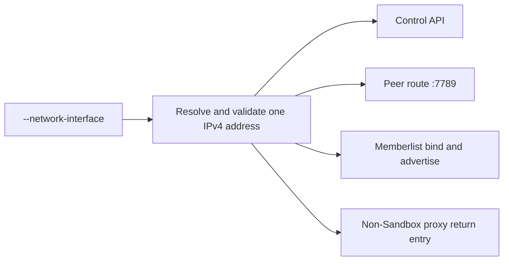
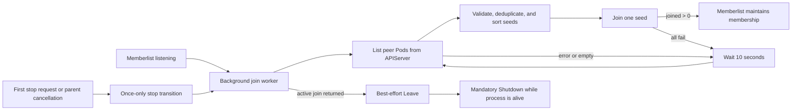

# Sandbox Manager Network Interface Binding and Reliable Peer Discovery

## Summary

Sandbox Manager accepts an optional `--network-interface` flag. When it is set,
one validated IPv4 address from that interface becomes the process-wide user
network address for the control API, peer route service, memberlist, and the
local return entry used by non-Sandbox proxy requests. When it is empty, the
existing non-hosted network behavior is preserved.

Peer discovery lists selector-matching Pods through a live, uncached Kubernetes
client built from the process `rest.Config`. Sandbox Manager and Sandbox Gateway
share that bounded listing contract: namespace and selector are required at
startup, each retry cycle performs at most one List while unjoined, and listing
stops after a successful join. After memberlist begins listening, seed
discovery and joining run in the background with retry. Shutdown stops new
discovery and retries; an active join returns under its network deadlines. A
once-only stop transition gives one lifecycle owner responsibility for Leave
and Shutdown. This keeps temporary peer absence from blocking the control API
without creating competing cleanup paths.

## Background

A hosted Sandbox Manager Pod has both a platform network and a user network.
Endpoints that serve or advertise user-cluster traffic must consistently use
the user network; selecting different local addresses can make a process
reachable through one protocol but isolated through another.

Peer Pods also start and stop independently. A one-time Kubernetes list or a
single synchronous join turns ordinary startup ordering into permanent
isolation. Reliable discovery therefore retries a namespace- and
selector-scoped live Pod list until a join succeeds, then hands membership to
memberlist. That retry is independent of API readiness.

## Target Design

### One user network address

`--network-interface` has the following contract:

- An empty value preserves the established non-hosted behavior. The control
  API and peer route service listen on all local addresses. Memberlist uses
  `POD_IP` when present, otherwise the first non-loopback IPv4 address. The
  non-Sandbox proxy return entry remains on loopback.
- A non-empty value is an exact operating-system interface name. The interface
  must exist, be up, and have exactly one global-unicast IPv4 address. Missing,
  down, addressless, or multi-address interfaces make startup fail. The process
  never falls back to another interface.
- The address is resolved and validated once during startup. Address changes
  take effect after a process restart.
- The same address is used by the control API listener, the peer route listener
  on port `7789`, and memberlist's bind and advertised address. The non-Sandbox
  proxy return entry uses this address as well, so return traffic does not
  silently switch to loopback after the listeners move to the user network.
- Interface selection controls local listeners and advertised peer identity. It
  does not use `SO_BINDTODEVICE`, select outbound routes, or change DNS policy.

The ext-proc listener on port `9002`, pprof, metrics, and other observability
listeners are outside this address contract. Their enablement and exposure are
separate concerns.

### Bounded peer listing

Sandbox Manager assembly builds an uncached controller-runtime client from the
same `rest.Config` already supplied to the process. It does not add a Pod
informer to the shared sandbox cache, and it does not list through
`APIReader`. Peer code receives that client as a reader; it does not import or
read the cache, and it does not read through Infra.

Listing is restricted by both of these required inputs:

- a non-empty system namespace; and
- a non-empty, syntactically valid peer label selector.

Invalid or absent scope is a startup error rather than an unfiltered Pod list.
Sandbox Manager also requires a non-nil `rest.Config` so assembly can build the
live client.

Sandbox Manager and Sandbox Gateway share this listing contract. Gateway builds
the same kind of live client from in-cluster configuration. While unjoined,
each retry cycle performs at most one live Pod list and stops listing after a
successful join. API availability therefore affects peer convergence, not
control-API or Gateway readiness. Both otherwise share the retrying join and
shutdown lifecycle described below.

The Gateway is loaded into Envoy as a Go shared library. Its peer server
registers for process `SIGTERM`, invokes the shared once-only stop path, restores
the host process's original signal handling, and relays `SIGTERM` to the process
after that stop attempt returns. Forced termination can still cut this
best-effort cleanup short under the crash behavior described below.

### Trusted seed addresses

Each listed, selector-matching Pod can contribute at most one seed:

- Without a `memberlist-url` annotation, the seed is the Pod's `status.podIP`
  plus the configured memberlist port.
- With the annotation, its host must be the same valid IP as
  `status.podIP`; only the port may differ. An annotation cannot redirect peer
  traffic to another Pod, tenant, or external address.
- Pods with an empty or invalid PodIP, invalid annotated address, the local
  memberlist address, or a duplicate address are excluded.

The eligible member set consists only of selector-matching peer Pods, including
Sandbox Gateway and any Sandbox Manager replicas that share that peer identity.
The local member is excluded. A Kubernetes Service and its mirrored or selected
backends are routing objects, not peer membership or seed sources.

Pod readiness and phase do not filter the seed set. They are not reliable
membership signals: a newly starting peer may already accept memberlist
traffic, while memberlist itself owns ongoing liveness after a join.

Seeds are sorted into a stable order and joined one at a time. Per-seed joining
keeps one unreachable address from delaying attempts against every remaining
seed in the same memberlist call.

### Non-blocking join lifecycle

Memberlist begins listening before seed discovery starts. Sandbox Manager then
runs the following lifecycle in the background:

1. List eligible peer Pods from the API server and derive trusted seed
   addresses.
2. Try seeds individually in stable order.
3. Stop discovery after any join reports `joined > 0`.
4. If the list fails, no seeds exist, or every join fails, wait 10 seconds and
   retry.

Joining is not a readiness condition and does not delay control API startup. A
replica may temporarily operate as a single member; successful joining hands
ongoing membership changes to memberlist, so periodic Kubernetes rediscovery is
unnecessary.

Kubernetes listing and the 10-second retry wait stop immediately when the peer
lifecycle context is canceled. Memberlist's join API has no context parameter,
so an already-started join returns under memberlist's existing network
deadlines rather than being interrupted by cancellation. Its default connection
and stream deadlines are each 10 seconds, and a complete push/pull can cross
more than one deadline window. No new join or retry starts after cancellation.

Known limit: there is no single 10-second upper bound for a complete in-flight
join. If shutdown must interrupt that work immediately or enforce one overall
deadline, the upgrade path is a context-aware memberlist transport that
preserves memberlist's dynamic-port and cleanup semantics. That transport is
not part of this proposal.

### Startup and shutdown boundary

Startup fails before serving requests when the selected interface, resolved
address, namespace, selector, peer client, control API listener,
peer route listener, or memberlist listener is invalid. The initial seed set
and join result are deliberately not startup requirements.

Each peer instance establishes one lifecycle owner when memberlist starts. That
owner remains until cleanup finishes, including after seed discovery succeeds.
The first explicit stop request or parent-context cancellation activates that
owner's cleanup with once-only semantics and cancels the peer lifecycle context.
Concurrent or later stop requests observe the same completion and result rather
than starting another leave or shutdown sequence. A caller's wait deadline does
not transfer cleanup ownership or create a competing close path. Stop may race
memberlist Start; Start then observes the
stopped state and returns without creating a second cleanup path. Cleanup
remains safe when startup initialized only some components.

Sandbox cache synchronization completes before the process serves requests.
The process stop handler is installed before that wait, so SIGTERM or Ctrl+C
runs the same Stop path. A forced kill during synchronization is the crash
model described below.

The lifecycle owner prevents new discovery work, allows an in-flight join to
return under the network-deadline boundary described above, and then attempts
`Leave` before `Shutdown`. `Leave` is best effort and has a five-second limit;
its failure is reported but never prevents `Shutdown` while the process remains
alive. No code path calls `Leave` after `Shutdown`, and the join worker never
races a separate stop caller for ownership of memberlist cleanup.

If the process is forcibly terminated before the active join returns or the
leave message is delivered, other members temporarily retain a stale active
member and remove it through memberlist's normal failure detection. This is the
same cluster-level failure model as a process crash, OOM, node loss, or network
partition. Peer membership is not a quorum or authorization source. A stale
peer may add only bounded per-peer fanout delay or error: it must not roll back
local route state, change the outcome of an authoritative Sandbox mutation, or
prevent parallel synchronization to other live peers.

Failure detection removes an unreachable member from the surviving members'
view. It does not promise that two isolated memberlist partitions will merge
again without an external seed after connectivity returns; successful seed
discovery intentionally stops its Kubernetes retry loop.

Cleanup is safe even when startup stopped after only some components were
initialized; cleanup must not replace the original startup error with a panic.

### Compatibility and ownership

This proposal adds only the optional CLI flag. It does not change CRDs, HTTP
models, Secrets, or the memberlist wire protocol. Both in-cluster configuration
and `KUBECONFIG` continue to supply the user-cluster Kubernetes client.

Network address resolution, process peer discovery, and peer lifecycle belong
to the Manager layer because they coordinate Sandbox Manager processes rather
than implement a Sandbox backend. Command entrypoints only accept the flag and
assemble these capabilities, including constructing the live peer client from
`rest.Config`. API protocol behavior and Infra backend behavior remain unchanged.

The following are outside this proposal:

- memberlist encryption and peer-route mTLS;
- disabling ext-proc or changing the port `9002` listener;
- metrics, pprof, or observability listener isolation;
- Deployment, RBAC, KDM, or rollout configuration;
- an informer refactor for Sandbox Gateway;
- IPv6, address hot reload, or periodic seed reconciliation.

No RBAC change is required for Sandbox Manager: its existing Pod permissions
already include `get`, `list`, and `watch`. Peer discovery treats listed Pods as
read-only objects and never mutates them.

Deployment changes remain outside this proposal, but hosted activation depends
on them. Kubernetes TCP probes without an explicit host target the Pod IP; when
the control API and peer route bind only to a different user-interface address,
those probes cannot reach the listeners and can restart the Pod. Hosted rollout
configuration must make the `8080` and `7789` probes reach the selected user
address before enabling `--network-interface`.

## Risks

- Live Pod listing during retry depends on APIServer availability. Namespace and
  label filtering bound each list to the peer Pods for one Sandbox Manager
  scope, and listing stops after the first successful join.
- A canceled process can remain in a memberlist join across multiple 10-second
  network-deadline windows. An immediate-cancellation requirement has a defined
  transport-based upgrade path.
- Forced termination can skip Leave and temporarily retain a stale member.
  Memberlist failure detection removes it; the stale entry may add bounded
  per-peer fanout failure but cannot change authoritative Sandbox state.
- An interface address can change while the process is running. Resolving once
  avoids split listener identity; operational recovery is a restart.
- The API may become ready while the replica is still a single member. This is
  intentional: background retry repairs startup races without making peer
  availability a control-plane availability dependency.

## Alternatives

- A shared Pod informer on the sandbox cache is rejected because seed discovery
  lists a handful of process Pods until join succeeds, then stops. A
  process-lifetime watch expands cache filters, startup registration, and tests,
  and makes memberlist wait on informer sync.
- Listing through the manager `APIReader` is rejected. That reader is the
  cache-bypass Get fallback, not a substitute for informers. Assembly constructs
  a dedicated uncached client from `rest.Config`, matching Gateway.
- Picking the first address from a multi-address interface is rejected because
  address ordering is not a stable network identity.
- Trusting an arbitrary `memberlist-url` host is rejected because Pod metadata
  must not redirect peer traffic outside the selected Pod identity.
- A custom cancellable memberlist transport is deferred because this scope
  accepts memberlist's existing network-deadline behavior, and a correct
  transport must preserve more than dialing alone.
- Continuous Kubernetes seed reconciliation after a successful join is
  rejected because memberlist already owns membership convergence.
