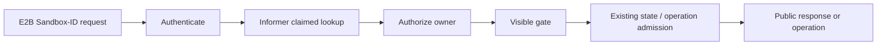

# Sandbox Lookup and E2B Visibility Boundary

## Summary

This proposal gives each user delivery of a Sandbox an explicit persisted commit point and
separates identity lookup, delivery visibility, and existing state admission. The existing
`agents.kruise.io/lock` is the epoch of the current delivery. A new system annotation,
`agents.kruise.io/delivered-lock`, is written with that epoch only after all Create
post-processing succeeds. The delivery is complete when the two values match, and Create does not
return success before that commit succeeds.

The first persisted Create write still claims or creates the Sandbox, but keeps the delivery
invisible and writes the API request's absolute deadline to `ShutdownTime`. All E2B API requests
have a common maximum duration of ten minutes, which is also the maximum delivery duration. After
post-processing, Create uses a resourceVersion-guarded Patch to atomically commit
`delivered-lock` and replace the temporary `PauseTime` and `ShutdownTime` with final values
calculated from the delivery time. Controller deletion wins over delivery commit. If the temporary
deadline deletes the Sandbox before commit, Create returns `504` instead of reporting success.

`infra.Sandbox.GetVisibility()` evaluates `(visible, reason)` from the current informer object.
Visibility is false when delivery has not committed, epochs differ, `cleanup=true`, ShutdownTime
has passed, persistent deletion has started, or Phase is `Succeeded`, `Failed`, or
`Terminating`. Every Sandbox-ID endpoint requires Visible before reusing the existing
`GetState()` and its own operation admission. A missing object returns `404`. An object owned by
another user returns the same `404` to prevent disclosure. An owned object that is invisible or
ineligible never returns not-found; it uses `401`, `400`, or `409` already declared by the
upstream endpoint.

After the Visible gate, List and Describe keep the current state semantics, expose only `running`
or `paused`, and preserve the compatibility mapping
`dead/RunningResourceClaimedButNotReady -> running`. This proposal adds no `Healthy` getter. The
current Phase-to-state mapping and the `dead` state remain unchanged and are explicitly deferred
for later discussion.

## Background

The current claim and clone flows persist owner, Sandbox ID, and lock before they wait for Ready,
initialize the runtime, process credentials, perform CSI mounts, and create the E2B TrafficPolicy.
Treating claimed or lock alone as public existence can expose a delivery that has not completed
and may ultimately fail through List, Describe, or another Sandbox-ID operation.

Manager point lookup also filters objects against a caller-supplied state set. An object can exist
and be owned by the requester, yet a Ready fluctuation, expiry, or transition that falls outside
one endpoint's set can make the failure surface as `404`. The Sandbox route cache cannot be the
authority for existence either: a missing route may only reflect runtime state or route
projection, not the absence of a claimed Sandbox from the informer.

These concerns require distinct facts:

1. Lookup answers whether the claimed object for a Sandbox ID exists and who owns it.
2. Delivery commit answers whether that epoch was fully delivered.
3. Visible answers whether the delivery remains in the E2B operation surface.
4. Existing state and operation capabilities answer whether the current endpoint can proceed.

`pkg/utils.GetSandboxState` is an aggregate compatibility state, not persisted existence. It
returns `dead` for different facts, including deletion, ShutdownTime expiry, terminal phases, and
a Running Sandbox that is not Ready. This proposal therefore neither equates `dead` with absence
nor allows a state mismatch to produce not-found.

The
[upstream E2B OpenAPI](https://github.com/e2b-dev/E2B/blob/f0facc5dbcf93067326745e1597b05311c0174ea/spec/openapi.yml)
permits only `running` and `paused` as public Sandbox states and declares
`504 Backend timeout` for Create, Resume, and Connect. This proposal uses only responses declared
for each endpoint and does not extend the upstream contract.

### Scope

- Narrow Manager Sandbox lookup to claimed identity, namespace, Sandbox ID, and owner from the
  informer, without accepting or reading an expected state.
- Add an epoch-matched persisted completion marker to Create deliveries shared by Claim and Clone.
- Add a protocol-neutral Visible observation to `infra.Sandbox` and make it a common prerequisite
  for every Sandbox-ID endpoint.
- Give List, Describe, and every other Sandbox-ID endpoint one ordering for lookup, ownership,
  Visible, and state decisions.
- Define one centralized ten-minute server hard limit for E2B business requests and map it to
  `504` when the upstream endpoint contract allows it.
- Retain Controller responsibility for ShutdownTime deletion and recycle cleanup without making
  Manager delete success depend on recycle completion.
- Apply the same contract to native E2B paths and customized-prefix paths.

### Non-goals

- Changing the precedence, states, reasons, or existing Phase mappings of
  `pkg/utils.GetSandboxState`.
- Removing `dead` in this proposal or adding `Healthy`, readiness, pause-transition, or other
  new state dimensions.
- Adding a `DeliveryDeadline` CR field; temporary delivery expiry reuses `ShutdownTime`.
- Redefining gateway route projection, proxy traffic admission, or Controller workload health.
- Adding a coordination protocol for informer delay, clock skew, or cross-replica consistency.
  Each replica uses its current informer observation, and brief cross-replica disagreement is
  accepted.
- Using APIReader List or substituting the route Store for informer-backed Sandbox lookup.
- Automatically deleting or recycling Sandboxes in `Succeeded` or `Failed`.
- Designing migration for old delivery data, a lock-only compatibility fallback, or another Infra
  backend.
- Changing the existing fail-closed lookup behavior for an ambiguous Sandbox ID.

## Target Design

### Responsibility boundaries

| Decision | Owner | Contract |
|---|---|---|
| Authenticate the request | E2B API | Verify caller identity without inferring Sandbox existence from a route |
| Resolve a claimed Sandbox | Infra | Match namespace and public Sandbox ID from the informer; distinguish absence, ambiguity, and internal failure |
| Authorize ownership | Manager | Use Sandbox owner metadata without reading state or Visible |
| Persist delivery | Manager and Infra capability | Commit complete delivery with a lock epoch and conditional Patch |
| Calculate Visible | Infra Sandbox | Return a boolean and stable reason from protocol-neutral persisted facts |
| Map HTTP and E2B state | E2B API | Apply Visible first, then reuse existing state and endpoint-specific admission |
| Handle timeouts and recycle | Sandbox Controller | Delete expired Sandboxes, complete recycle, and clear prior-delivery data |

The Route Store may continue to serve gateway routing and projection, but a missing route, a
`dead` route, or a route that has not synchronized cannot preemptively classify a Sandbox-ID
request as not-found while the Sandbox exists in the informer.

### Manager point-lookup contract

`SandboxManager.GetSandbox` accepts a context, requesting user, and protocol-neutral lookup
options. A successful result means only:

> A claimed Sandbox matching the namespace and Sandbox ID exists in the informer and is owned by
> the requesting user.

It does not imply completed delivery, Visible, health, Ready, or eligibility for an operation.
Lookup follows these rules:

1. An empty user is rejected before lookup.
2. Infra selects only a claimed object matching namespace and Sandbox ID.
3. Definitive absence maps to Manager not-found. An ambiguous ID is also hidden as not-found
   externally while retaining its internal cause. Other lookup failures map to internal error.
4. Manager verifies owner after successful lookup; a mismatch returns not-allowed.
5. Manager returns `infra.Sandbox` without reading, logging, or filtering `GetState()` or a
   Visible reason.

Authentication and point lookup cannot depend on the local Route Store owner mapping. E2B reads
Visible and other internal diagnostics only after it receives an authorized Sandbox, preventing
another user from probing an object through error differences.

### Delivery epoch and commit marker

Every Claim or Clone delivery uses a non-empty lock string. That value already identifies one
quota and claim attempt, so this proposal uses it directly as the delivery epoch instead of
generating a second epoch.

| Persisted fact | Meaning |
|---|---|
| `agents.kruise.io/lock` | Current delivery epoch |
| `agents.kruise.io/delivered-lock` | Completed delivery epoch; it must exactly equal lock |
| `agents.kruise.io/cleanup=true` | Cleanup is committed for this delivery and irreversibly ends Visible |
| `Spec.ShutdownTime` | Hard delivery deadline before commit; normal lifecycle deadline afterward |
| `Spec.PauseTime` | Normal auto-pause deadline committed only when delivery completes |

`delivered-lock` is a system-owned annotation and cannot be supplied through E2B metadata. Claimed
identity, owner, Sandbox ID, or lock alone does not mean delivery is complete.

#### First persisted write: claim without delivery

The Claim Update/Create and Clone Create persist the following together:

- the delivery lock epoch, owner, claimed identity, and Sandbox ID;
- removal of `delivered-lock` and `cleanup` left by a prior delivery;
- an empty `PauseTime`;
- the current API request's absolute deadline in `ShutdownTime`; and
- `Visible=false`.

Internal retries for the same epoch cannot move the temporary `ShutdownTime` later. Only a new
delivery with a new lock epoch establishes a new ten-minute deadline.

#### Post-processing and final delivery

Create delivery includes every activity required before a successful response: waiting for
Sandbox Ready, runtime initialization, delivery-participating credential and token processing,
CSI mounts, security and network configuration, and TrafficPolicy creation when required. Failure
of any activity prevents both `delivered-lock` and a successful response.

After all post-processing succeeds, Create performs one resourceVersion-guarded conditional Patch
against the same Sandbox. The commit requires the same epoch with no deletion or cleanup in
progress, and atomically:

- writes `delivered-lock = lock`;
- replaces the temporary `ShutdownTime` with the final lifecycle value calculated from actual
  delivery time;
- writes the corresponding final `PauseTime`; and
- for a never-timeout delivery, clears the temporary `ShutdownTime` and leaves the final deadline
  empty as requested.

Create returns `201` only after that Patch succeeds. The final Patch cannot ignore resourceVersion
and overwrite a Controller or concurrent lifecycle write. Conflict, object deletion, epoch
change, or context expiry means the delivery did not commit. Deletion caused by the temporary
deadline and request expiry map to `504` as specified below. A conditional conflict or persistence
failure that cannot be classified as that timeout uses Create's declared `500` and returns neither
`201` nor `404`.

#### Controller deletion wins

After the temporary `ShutdownTime` expires, the Controller may delete the undelivered Sandbox
without understanding a separate DeliveryDeadline. If the Controller deletes the object before
the final Patch, the Patch must fail. Create returns Manager `ErrorTimeout` as `504` with this
public message:

> sandbox creation timed out; the sandbox was deleted before it became available

The API neither disguises this failure as `404` nor returns an uncommitted Sandbox. The Controller
keeps its current behavior for `Succeeded` and `Failed` phases: they may remain undeleted after
ShutdownTime, but they are always `Visible=false`.

### Common API request limit

The E2B API layer defines one centralized `MaxAPIRequestDuration = 10m` server hard limit for
business requests. Each request establishes one absolute deadline on entry. An existing earlier
deadline wins, and internal stages cannot each acquire a fresh ten-minute window.

- Create uses this deadline as both delivery timeout and the temporary `ShutdownTime` in the first
  persisted write.
- Resume and Connect inherit the same limit from request context; Manager and Infra do not depend
  on the API constant.
- Existing shorter operation-level timeouts continue to apply.
- Health, Prometheus metrics, and process shutdown are outside this business-request limit.

A hard timeout maps to the declared `504` response for Create, Resume, and Connect. For another
endpoint that does not declare `504`, it maps to the endpoint's declared `500` instead of adding a
new response code.

### Visible contract

`infra.Sandbox.GetVisibility()` returns `(visible bool, reason string)`. It reads only the informer
observation already carried by `infra.Sandbox` plus the current time and performs no Kubernetes
read or write. The caller obtains one reason using this precedence:

| Priority | Condition | Visible | Reason |
|---:|---|---:|---|
| 1 | `DeletionTimestamp` is set | false | `DeletionStarted` |
| 2 | `agents.kruise.io/cleanup` exactly equals `"true"` | false | `CleanupCommitted` |
| 3 | The current time has passed a non-empty `ShutdownTime` | false | `ShutdownTimeReached` |
| 4 | Phase is `Succeeded` | false | `ResourceSucceeded` |
| 5 | Phase is `Failed` | false | `ResourceFailed` |
| 6 | Phase is `Terminating` | false | `ResourceTerminating` |
| 7 | lock is absent or empty | false | `DeliveryEpochMissing` |
| 8 | delivered-lock is absent or empty | false | `DeliveryNotCommitted` |
| 9 | delivered-lock does not equal lock | false | `DeliveryEpochMismatch` |
| 10 | None of the conditions above holds | true | `Delivered` |

`cleanup-enabled` does not participate; it only describes whether the Controller supports
recycle. Once a trusted internal writer commits `cleanup=true`, the current delivery immediately
and irreversibly ends Visible, regardless of whether recycle is enabled, started, or completed.
Other cleanup values do not end Visible.

Ready, `PauseTime`, and other phases do not participate in Visible. A Visible reason is used only
for structured logs and internal audit after authorization. It is not exposed in a public
response, and actual lock or delivered-lock values are never logged. Each Sandbox-ID endpoint logs
one result after ownership authorization. List produces no per-object log while filtering.

### E2B lookup, state, and operations

Every Sandbox-ID endpoint uses the same decision order:

1. authenticate the caller;
2. look up a claimed Sandbox from the informer;
3. authorize its owner;
4. require `Visible=true`; and
5. reuse the existing `GetState()` or endpoint capability for operation-specific admission.

Visible is a common prerequisite, not a new state and not a replacement for authoritative
operation validation. Pause, Resume, Connect, Network, Set timeout, Snapshot, Browser,
traffic-token refresh, and Delete retain their existing state or capability rules.

#### List and Describe

For a `Visible=true` Sandbox, List and Describe continue to use the current aggregate state:

| `GetState()` result | E2B read result |
|---|---|
| `running` | Expose as `running` |
| `paused` | Expose as `paused` |
| `dead` with reason `RunningResourceClaimedButNotReady` | Compatibility-map to `running` |
| `creating` | Unsupported |
| Any other `dead` reason, state, or unknown value | Unsupported |

Within one observation, expiry, deletion, cleanup, and terminal objects already excluded by
Visibility cannot become a public state. If a concurrent change or time boundary causes
`GetState()` to return another `dead` afterward, it is likewise unsupported.

The current `GetState()` maps non-Running, non-terminal claimed phases such as `Resuming` and
`Upgrading` to `paused`. This proposal temporarily accepts and preserves that behavior without an
additional special case.

Describe returns `401` for an owned Sandbox that is `Visible=false` or has an unsupported state,
and never returns `dead`, `creating`, or another internal state. List removes invisible and
unsupported results before state and metadata filtering and before pagination. It then filters on
the projected `running` or `paused` state, so the page limit and next token describe only the
public result set.

#### Delete and recycle

Delete also requires `Visible=true`. For a recyclable Running Sandbox, a successful Manager write
of `cleanup=true` accepts the delete and immediately ends Visible for this delivery. Manager does
not wait for the Controller to complete recycle or make completion a prerequisite for the API
response.

If the recycle-trigger write fails, the existing Kill fallback remains available. After Kill
successfully starts persistent deletion, `DeletionTimestamp` ends Visible. Only after the object
disappears from the informer does a later lookup become an actual not-found.

On successful recycle, the Controller clears the prior delivery's lock, delivered-lock, owner,
Sandbox ID, claim-scoped metadata, `PauseTime`, `ShutdownTime`, and TrafficPolicy before returning
the CR to the pool. This prevents a later Claim from inheriting the old epoch, but Manager delete
semantics do not depend on cleanup completion. The next delivery uses a new lock and performs a
new delivery commit. Once claimed identity and the old Sandbox ID are cleared, a later lookup of
the prior delivery is an actual absence even though the reusable CR remains in the informer.

### HTTP errors and information disclosure

Every native and customized Sandbox-ID endpoint uses this public classification:

| Condition | HTTP status | Public meaning |
|---|---:|---|
| API key is missing or invalid | 401 | Authentication failed |
| No matching claimed Sandbox exists in the informer | 404 | Actual absence |
| More than one claimed Sandbox matches the same ID | 404 | Fail closed on ambiguity without choosing an object |
| The Sandbox exists but has another owner | 404 | Same response as absence to prevent disclosure |
| The Sandbox is owned by the requester but `Visible=false` | 401 | This delivery is ineligible; not not-found |
| Visible, but Pause, Resume, Connect, or Network has a state conflict | 409 | Conflict declared by the endpoint |
| Visible, but Snapshot does not allow the state | 400 | Bad request declared by the endpoint |
| Visible, but Describe, Set timeout, Browser, traffic-token, or another operation without 400/409 disallows it | 401 | Rejection declared by the endpoint |
| Informer lookup is inconclusive or an internal failure occurs | 500 | Server failure; never downgraded to 404 |
| Final Create delivery commit fails from a non-timeout conflict or persistence failure | 500 | Server failure declared by Create |
| Create, Resume, or Connect reaches the server hard limit | 504 | Backend timeout |
| Another endpoint reaches the server hard limit | 500 | Server error declared by that endpoint |

No state, Ready, Visible, route, cleanup, expiry, or delivery failure may produce `404`. The only
`404` cases are actual absence, fail-closed ID ambiguity, and concealment of another owner. All
three use the same public message. Visible and state reasons for the current owner and the
ambiguity cause are written only to internal logs.

### Invariants

- Create never succeeds before delivery commit, and neither List nor a Sandbox-ID endpoint returns
  that delivery before commit.
- `delivered-lock == lock` proves delivery only for the current epoch; a marker from an earlier
  epoch cannot make a new delivery Visible.
- `cleanup=true`, ShutdownTime expiry, deletion start, and the three explicit terminal phases end
  Visible.
- A Sandbox that still exists in an informer and is owned by the requester never returns not-found
  solely because state or Visible fails.
- Every operation requires Visible before its existing state or capability admission.
- Manager point lookup accepts no E2B state and does not read `GetState()`.
- List and Describe expose only `running` and `paused` and filter before pagination.
- The final delivery Patch cannot overwrite deletion or an update won by the Controller.
- A request receives at most one ten-minute budget; internal retries do not reset it.
- Reads use only informer state; different replicas may briefly return different results.

### Compatibility boundary

A lock-only Sandbox without delivered-lock is `DeliveryNotCommitted` and receives no speculative
delivery fallback. This is a fail-closed boundary: the proposal does not infer completed delivery
for an old object from creation time, current state, or Ready, and defines no historical-object
migration.

## Alternatives

### Add a Healthy getter

Health would collapse Ready fluctuation, transitions, and E2B read policy into another boolean
while still failing to produce a public `running` or `paused` state. This proposal keeps the
simple combination of Visible and the existing state.

### Mark delivery in the first lock write

That would expose a Sandbox before Ready, runtime, credentials, CSI, or TrafficPolicy
post-processing succeeds, breaking the alignment between Create success and public delivery.

### Add a DeliveryDeadline field

A separate field would expand the CRD contract even though `ShutdownTime` can already bound an
invisible delivery and the final Patch replaces it with the normal lifecycle deadline.

### Wait for Controller recycle before ending Visible

That would make API delete success depend on asynchronous Controller convergence. Treating
`cleanup=true` as the irreversible commit ends the current delivery immediately while the
Controller continues resource cleanup in the background.

### Keep state filtering in Manager lookup

That would continue to mix existence with operation admission and produce not-found when an owned,
existing object does not match a state.

## Risks

- The resourceVersion-guarded final delivery Patch can fail on a concurrent write even after all
  post-processing completes. This deliberately gives Controller and concurrent lifecycle writes
  priority over Create success.
- `Succeeded` and `Failed` Sandboxes may persist while remaining invisible to E2B and may continue
  consuming existing resources or quota. This proposal adds no janitor and does not guarantee
  their deletion by ShutdownTime.
- Visible depends on local time and informer observation. Clock skew and replica cache progress can
  cause brief differences, which this proposal explicitly accepts.
- The new marker fails closed. Historical or partially written objects without delivered-lock do
  not automatically become Visible.
- The current aggregate state exposes several transition phases as `paused` and collapses different
  facts into `dead`. This proposal preserves that compatibility behavior, so a state reason is not
  a complete lifecycle model.
- Gateway routes retain their own projection and synchronization lifecycle. Sandbox-ID APIs no
  longer infer absence from a missing route, but this proposal does not make API Visible identical
  to traffic reachability.

## Deferred Follow-up

The following topics are explicitly deferred. They do not block this proposal or change its
`implementable` status:

- Re-evaluate the current mapping of non-Running phases such as `Resuming` and `Upgrading` to
  `paused`.
- Remove the `dead` state and define new neutral semantics for current consumers of `dead` and its
  reasons.
