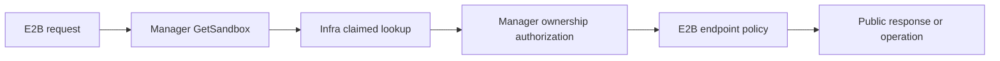

# Sandbox Lookup and E2B Visibility Boundary

## Summary

This proposal separates claimed-Sandbox lookup from E2B lifecycle visibility.
`SandboxManager.GetSandbox` resolves a claimed Sandbox by namespace and Sandbox ID, verifies that
it belongs to the requesting user, and returns the existing `infra.Sandbox` handle. It no longer
accepts expected state strings or reads `infra.Sandbox.GetState()`.

E2B owns all protocol visibility after lookup and ownership authorization. List and Describe use
one E2B public projection: a visible Sandbox is reported only as `running` or `paused`, List state
filters match that projected state, and all visibility filters run before pagination. A claimed
Sandbox in Running phase but not Ready remains publicly `running`; creating, expired, terminating,
deleted, completed, and unsupported observations are hidden. Thus a Sandbox observed through List
has the same visibility and public state that Describe would return from the same observation.

Other endpoints keep their existing externally visible behavior and continue to apply their own
operation-specific state rules. This is an incremental boundary change: `GetState()` and
`metav1.Object` remain on `infra.Sandbox`, no orthogonal lifecycle getters are added, and the wider
state model is not redesigned.

## Background

The current Manager point lookup answers two unrelated questions:

1. Does the claimed Sandbox identified by namespace and Sandbox ID exist, and is it owned by the
   requester?
2. Is its aggregate state accepted by the calling E2B endpoint?

The first question is backend-neutral identity and authorization. The second is protocol policy:
Describe, Connect, Delete, Snapshot, and other E2B operations do not all mean the same thing by
"visible" or "usable." Passing E2B state sets into Manager couples a general lookup contract to
API-specific state names and turns a state mismatch into a lookup failure.

List has a separate inconsistency. It filters the raw aggregate state before converting a Sandbox
to an E2B response, while Describe first applies its viewability rules and then maps a Running but
not Ready Sandbox from internal `dead` to public `running`. Consequently, the same Sandbox can be
returned by Describe but omitted from the unfiltered List or from `state=running`.

The [upstream E2B OpenAPI schema](https://github.com/e2b-dev/E2B/blob/main/spec/openapi.yml) defines
only `running` and `paused` as public Sandbox states. Returning an internal state such as `dead` is
not a valid fallback. In particular, an expired Sandbox whose shutdown time has passed must be
hidden rather than returned with an internal state.

### Scope

- Remove expected-state input and aggregate-state reads from `SandboxManager.GetSandbox`.
- Keep claimed lookup, namespace and Sandbox ID matching, ownership authorization, lookup error
  classification, and caller-supplied lookup deadlines unchanged.
- Move every E2B caller's existing state eligibility to the E2B layer without changing that
  endpoint's external behavior.
- Give List and Describe one shared, fail-closed public visibility and state projection.
- Require the Sandbox selection used by E2B List to return claimed Sandboxes matching namespace
  and owner.
- Preserve authentication-before-ownership and ownership-before-state evaluation.

### Non-goals

- Changing `pkg/utils.GetSandboxState`, its precedence, states, or reason strings.
- Removing `infra.Sandbox.GetState()` or replacing it with orthogonal readiness, pause, deadline,
  release, or delivery getters.
- Redefining Delete, Pause, Resume, Connect, Browser, Network, Set timeout, Snapshot, or
  traffic-token behavior.
- Changing SandboxSet or SandboxClaim behavior, including their Manager and state use.
- Removing `metav1.Object` from `infra.Sandbox` or prohibiting upper layers from reading Sandbox
  semantics through that interface.
- Designing another Infra implementation, migration behavior, stale-data compatibility, or a
  complete cross-backend state model.
- Changing Sandbox ID allocation or the existing ambiguous-ID lookup behavior.

## Target Design

### Responsibility boundaries

Lookup, public discovery, and operation admission are separate decisions:

| Decision | Owner | Contract |
|---|---|---|
| Resolve a claimed Sandbox | Infra | Match namespace and public Sandbox ID; distinguish absence, ambiguity, and inconclusive failure |
| Authorize ownership | Manager | Match the requesting user with owner metadata exposed through `infra.Sandbox` |
| Hide backend diagnostic deliveries | E2B | Reserved-failed Sandboxes remain undiscoverable after ownership-safe lookup |
| Project public visibility and state | E2B List and Describe | Return only an E2B-visible `running` or `paused` Sandbox |
| Admit an operation | The owning E2B endpoint and Infra capability | Apply the endpoint's compatibility rule, then let the operation perform authoritative validation |

No E2B model, HTTP status, or protocol state set crosses into Manager or Infra. E2B receives the
same neutral `infra.Sandbox` handle as today and may read Sandbox semantics through that interface;
it does not cast to or directly read a concrete Sandbox CR.

### Manager point-lookup contract

`SandboxManager.GetSandbox` accepts the context, requesting user, and neutral Infra lookup options.
There is no expected-state argument. Its result has the following meaning:

> A claimed Sandbox matching the requested namespace and Sandbox ID exists and is owned by the
> requesting user.

It does not imply that the Sandbox is live, healthy, Ready, publicly visible, or eligible for an
operation.

The lookup retains these rules:

1. An empty user is rejected before lookup.
2. Infra resolves only a claimed Sandbox matching namespace and Sandbox ID.
3. Definitive absence remains Manager not-found. An ambiguous ID remains an opaque not-found while
   preserving its diagnostic cause. Other Infra failures remain internal errors.
4. Manager verifies owner metadata only after a successful lookup. A mismatch remains not-allowed.
5. Manager returns the Sandbox without reading, logging, or filtering aggregate state or reason.

The Infra lookup may wait for cache convergence while the context is live, so callers continue to
provide a deadline. Removing the state check does not weaken lookup identity or ownership
authorization.

### E2B lookup and operation policies

After Manager returns an owned Sandbox, E2B applies reserved-failed hiding and the calling
endpoint's own state rule. State mismatches no longer originate as Manager health errors, but
existing E2B status categories, messages, and information-disclosure boundaries remain unchanged
for endpoints other than the intentional List and Describe changes below.

The following table records why each consumer needs lifecycle information. These are endpoint
contracts for this increment, not new universal notions of `claimed`, `live`, or `visible`.

| Consumer | Lifecycle information needed | Contract in this proposal |
|---|---|---|
| Describe | Public discoverability and public state | Use the shared List/Describe projection |
| List | Public discoverability, public state, metadata filters | Use the shared projection before filtering and pagination |
| Delete | Idempotent cleanup eligibility | Keep its existing cleanup-specific rule; do not reuse public discovery |
| Pause | Existing API compatibility check, followed by authoritative pause admission | Keep current external behavior; `Sandbox.Pause` remains authoritative |
| Resume | Existing running-or-paused lookup compatibility, followed by authoritative resume admission | Keep current external behavior; `Sandbox.Resume` remains authoritative |
| Connect | Distinguish already running from paused/resuming, and reject existing non-live cases | Keep current response and resume behavior |
| Browser | Existing live lookup compatibility plus the actual runtime request | Keep current behavior |
| Network update | Existing live lookup compatibility plus control-plane mutation | Keep current behavior |
| Set timeout | Existing running-only deadline mutation | Keep current behavior |
| Create Snapshot | Existing running-only checkpoint admission | Keep current behavior |
| Traffic-token refresh | Route ownership, traffic-auth enablement, and existing running-or-paused eligibility | Adapt only to the state-independent GetSandbox signature; keep its Manager validation |

Public discovery is deliberately not a reusable gate for every operation. For example, Delete is
an idempotent cleanup API, while Connect must choose between returning an already-running Sandbox
and resuming a paused one. Changing Describe visibility must not silently change either operation.

### Shared List and Describe projection

List and Describe evaluate one E2B projection that produces either a public state or "not visible."
The projection is fail-closed:

| Aggregate observation from `infra.Sandbox.GetState()` | E2B projection |
|---|---|
| `running` | Visible as `running` |
| `paused` | Visible as `paused` |
| `dead` with reason `RunningResourceClaimedButNotReady` | Visible as `running` |
| `creating` | Not visible |
| `dead` with reason `ShutdownTimeReached` | Not visible |
| `dead` with reason `ResourceSucceeded`, `ResourceFailed`, `ResourceTerminating`, or `ResourceDeleted` | Not visible |
| Any other aggregate state or unsupported `dead` reason | Not visible |

Failing closed prevents a new internal state or reason from leaking into the E2B response before
its public meaning is deliberately defined. The only exceptional mapping is the existing Running
but not Ready case: the backend phase still represents the same user delivery, and E2B already
exposes it as `running` from Describe.

The projection result contains both visibility and the public state. Within one request, consumers
reuse that result for filtering and response conversion rather than evaluating visibility and
state independently. This guarantees that a timing boundary such as shutdown expiry cannot pass
one check and then produce an invalid `dead` response in the same request. It does not promise
cross-request snapshot consistency when the Sandbox changes concurrently.

#### Describe

Describe first performs the claimed, namespace, Sandbox ID, and owner-safe lookup. Reserved-failed
or non-visible results are returned as not found. A visible result is returned with exactly the
public state produced by the shared projection.

An expired Sandbox is therefore not found even if its CR still exists and still carries claimed
identity. Describe never returns `dead`, `creating`, `available`, or another internal state.

#### List

The selection used by E2B List is contractually limited to claimed Sandboxes matching the
requesting namespace and owner. Claimed is a selection invariant supplied by Infra, not a label
interpretation performed by E2B and not a new `IsClaimed()` getter.

For each selected Sandbox, List:

1. hides reserved-failed and non-visible results;
2. matches a requested `state` against the projected E2B state;
3. applies existing metadata filters; and
4. paginates the remaining results.

When no state filter is supplied, both public states are eligible. `state=running` includes a
Running but not Ready Sandbox because its public projection is `running`; `state=paused` includes
only results projected as `paused`. Internal state names are never accepted as List filters.

Visibility, public-state filtering, and metadata filtering all occur before pagination. Therefore
page limits and next tokens describe the visible, matching result set rather than raw backend
objects.

For the same claimed, owner-matching, uniquely identifiable Sandbox observation:

- Describe succeeds if and only if the Sandbox is eligible for an unfiltered List before metadata
  filters and pagination.
- The state returned by Describe equals the state returned by List.
- Filtering List by that returned state includes the Sandbox.

### Infra interface surface

No new `infra.Sandbox` getter is needed for this increment:

- Claimed status is guaranteed by point lookup and List selection contracts, so `IsClaimed()` would
  duplicate query semantics.
- The existing `GetState()` result supplies the temporary aggregate observation required by E2B
  compatibility and the shared public projection.
- Pause and Resume already expose operation capabilities whose implementations perform their
  authoritative validation.
- Existing timeout, route, request, checkpoint, network, and metadata methods supply the other
  endpoint facts.
- `metav1.Object` remains embedded and may continue to expose metadata through `infra.Sandbox`.

An `IsVisible()` or `IsLive()` getter would encode E2B policy in a protocol-neutral Infra
interface. Adding `IsReady()` or a structured pause status may become useful when a later proposal
removes another `GetState()` consumer, but neither is required to remove state filtering from
Manager or to align List and Describe now.

### Invariants and failure behavior

- Manager point-lookup success means claimed identity plus ownership, never lifecycle eligibility.
- Manager never accepts E2B state names and never calls `GetState()` from `GetSandbox`.
- Authentication precedes ownership authorization; ownership authorization precedes any
  state-dependent E2B decision or diagnostic disclosure.
- List and Describe return only `running` or `paused`.
- List and Describe share one fail-closed projection, including the Running-but-not-Ready exception
  and expired-Sandbox hiding.
- List filters the projected public state before pagination.
- Other endpoints do not inherit List/Describe visibility and keep their current public behavior.
- Upper layers read Sandbox semantics only through `infra.Sandbox`; they never depend directly on
  the concrete Sandbox CR.
- Infra selection remains informer-backed; this design introduces no APIReader List.

## Alternatives

### Keep expected states in Manager

This preserves the mixed responsibility and keeps a backend-independent lookup coupled to E2B
state vocabulary.

### Copy the current state sets into a new global E2B visibility rule

One rule cannot represent public discovery, idempotent cleanup, runtime access, resume behavior,
and checkpoint admission. It would preserve the same conflation at a different layer.

### Keep List filtering raw aggregate state

This leaves Running-but-not-Ready Sandboxes visible through Describe but absent from
`state=running` List results, and it permits response conversion to disagree with filtering.

### Add orthogonal lifecycle getters now

Readiness, pause transition, expiry, release, and workload capability are useful dimensions for a
larger state redesign. Adding them before another current consumer requires them would broaden this
increment and create interface contracts without a present cross-implementation need.

### Put E2B visibility in Infra

This would make Infra understand E2B public states and discovery policy, violating the neutral
backend boundary.

## Risks

- A future Manager caller may mistake successful lookup for a live Sandbox. The lookup result is
  explicitly limited to claimed identity and ownership; each use case must own further admission.
- A future internal state may be temporarily hidden from List and Describe. This is intentional
  fail-closed behavior until its E2B projection is defined.
- Moving existing endpoint checks can accidentally change status or message precedence. Apart from
  the specified List and Describe changes, current externally visible behavior is normative.
- List and Describe can still differ across separate concurrent requests because they may observe
  different backend versions or times. The guarantee applies when they evaluate the same
  observation, not across time.
- `GetState()` remains an aggregate compatibility dependency in E2B. This proposal narrows one
  boundary; it does not claim to complete the wider state decomposition.
