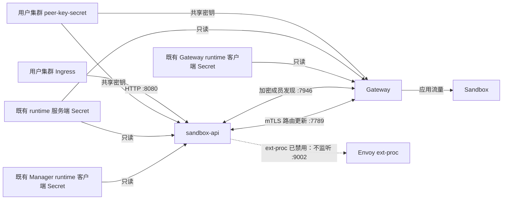

# Sandbox Manager Peer 安全与托管数据面关闭

## 摘要

每个托管 sandbox-api 实例服务一个用户集群，关闭 ext-proc，保留 peer 通信。`7946` memberlist 共享密钥加密与 `7789` mTLS 是两个独立功能：Manager 用 flags、Gateway 用环境变量，各自通过 Secret 引用启用；未配置则保留对应通道的明文通信。Secret 不承载开关。已配置但本地凭据无效时，整个实例启动失败，不降级为明文。

远端 Join 或同步失败只记录并继续其他 peer，不新增熔断或驱逐。仅 mTLS 配置不同不会隔离 memberlist 成员组；Ready 也不保证远端互通。托管部署终态要求两项保护都启用且配置兼容。Peer TLS 原样复用 runtime 凭据，保留独立加载与租户信任边界，并拒绝能冒充客户端的服务端证书。凭据按启动快照使用，变更通过重启生效；证书供应和部署不属于开源交付范围。

## 背景

Sandbox Manager 和 Sandbox Gateway 使用两条 peer 通道。`7946/TCP+UDP` 上的 memberlist 发现进程并维护成员关系；`7789/TCP` 上的路由同步在这些进程之间传递 Sandbox 状态。发现一个成员不等于认证其路由更新，保护路由更新也不能保护 memberlist 流量。

托管 Sandbox Manager 称为 sandbox-api，部署在用户集群之外，每个托管实例只服务一个用户集群，通过接入该用户集群网络的网卡提供控制 API。它需要保留 peer 通信，同时不处理用户应用流量。因此，Envoy 外部处理服务（ext-proc）必须能够独立于路由同步关闭。

Runtime 请求 TLS 消费已供应的凭据，Manager 和 Gateway 使用各自的客户端 bundle 格式。托管场景必须原样复用这些凭据及既有 runtime 服务端 bundle。证书签发与分发属于外部供应系统，不是 peer 安全要在开源仓库中新增的能力。

## 设计终态

### 范围与职责

本文定义开源 Manager、Gateway 及中立共享能力中的 peer 凭据、memberlist 加密、peer HTTPS/mTLS、本地启动校验与远端故障处理，以及 Gateway peer 接收端先于 memberlist 启动的顺序。网卡选择和 ext-proc 独立关闭保留[网卡与 peer 发现设计](20260824-sandbox-manager-network-interface-peer-discovery.md)中的合同。托管设置表达外部接入要求，不代表本次改动交付部署功能。Memberlist 加密与 peer TLS 相互独立，peer TLS 又独立于 runtime 请求 TLS；即使读取同一份证书 Secret，开启其中一项也不会开启、关闭或重新配置另一项。

| 组件 | 职责 |
| --- | --- |
| sandbox-api / 非托管 Manager | 提供控制 API，维护本地路由，管理配置允许的 peer 生命周期。 |
| Gateway | 维护和服务本地路由，接收 peer 更新，并推送唤醒操作产生的更新。 |
| 共享 peer 能力 | 解释 peer 安全输入，提供成员发现和路由传输，不包含 API 鉴权策略或 Sandbox 后端依赖。 |
| 外部用户集群部署渲染组件 | 保留共享密钥，分别配置 Manager 和 Gateway 的两项功能，提供 Secret 引用、数据键名及读取权限。 |
| 托管部署配置 | 向 sandbox-api 分别提供启用两项保护所需的用户集群 Secret 引用、数据键名和 ext-proc 关闭参数。 |
| 现有身份服务 | 持续供应既有 runtime 证书，不因托管工作流增加改动。 |

Manager 负责进程协调及其 peer 配置，这些不属于 Sandbox 后端能力。API 协议行为保留在 API 层。共享传输配置不得导入 Manager 配置、API 模型或 runtime 业务逻辑。独立的 Sandbox controller 不新增对 Manager、Gateway 或其 peer 编排的依赖。

复用凭据，是通过中立的解析能力和标准 TLS 消费证书字节。Secret 数据键名是带默认值的启动配置，默认值取自本仓库已有名称，不从签发者推断。不将内部 runtime 服务端、证书分发器、身份服务客户端或私有 feature gate 引入开源依赖闭包。Peer 组件读取显式引用的用户集群 Secret，不发现供应方、不要求特定签发者实现，也不管理其分发链。

本设计不引入证书签发、密钥轮换、热更新、新 Prometheus 指标、CRD、Service 后端发布或 runtime 请求改动。用户应用路由、Ingress 配置、证书供应及部署渲染仍由各自组件负责。Gateway 宿主进程退出如何到达 peer 清理所有者由独立 O6 负责；本文只要求新增的 listener 和主动连接能够由现有 `Stop` 路径释放。

代码成本是设计约束。复用现有路由 handler、路由顺序、有界推送和 peer 生命周期，将两项独立功能配置作为这些能力的启动输入，不新建配置框架或服务监督器。不引入统一安全开关、Secret 启用注解、成员能力宣告、配置指纹、熔断或主动驱逐；不猜测其他 Secret 数据键，也不增加证书格式。数据键名是带下述默认值的显式启动字符串。

下图展示托管部署同时启用两项保护的终态，不表示两项功能共用开关。

### 公开配置

Manager 提供以下启动参数。默认值保留未配置 peer 安全的非托管安装行为。

| 参数 | 默认值 | 合同 |
| --- | --- | --- |
| `--peer-key-secret` | 空 | 共享密钥 Secret 的精确 `namespace/name` 引用。非空启用 `7946` 加密；空则使用明文 memberlist。 |
| `--peer-key-secret-key` | `key` | 共享密钥的 Secret 数据键。空则用默认值。 |
| `--peer-tls-server-secret` | 空 | 既有 runtime 服务端 bundle 的精确 `namespace/name` 引用。与客户端引用一起启用 `7789` mTLS。 |
| `--peer-tls-server-ca-key` | `ca.crt` | 服务端信任 CA 的 Secret 数据键。空则用默认值。 |
| `--peer-tls-server-cert-key` | `tls.crt` | 服务端证书链的 Secret 数据键。空则用默认值。 |
| `--peer-tls-server-key-key` | `tls.key` | 服务端私钥的 Secret 数据键。空则用默认值。 |
| `--peer-tls-client-secret` | 空 | 本进程自身 runtime 客户端 bundle 的精确 `namespace/name` 引用。两个 TLS 引用都空时使用 HTTP，只配置其中一个则启动失败。 |
| `--peer-tls-client-ca-key` | `ca.crt` | 客户端信任 CA 的 Secret 数据键。空则用默认值。 |
| `--peer-tls-client-cert-key` | Manager：`client.crt`；Gateway：`tls.crt` | 客户端证书的 Secret 数据键。空则用本组件的默认值。 |
| `--peer-tls-client-key-key` | Manager：`client.key`；Gateway：`tls.key` | 客户端私钥的 Secret 数据键。空则用本组件的默认值。 |
| `--disable-envoy-ext-proc` | `false` | 跳过 `9002` ext-proc 监听和处理链路，保留 peer 路由及本地路由接入。托管 sandbox-api 固定设为 `true`。 |

这些参数名称是托管与非托管部署渲染共同遵循的合同。ext-proc 开关沿用网卡设计，不新增替代开关或别名。数据键参数描述布局，不是凭据；单独设置它们不会开启任何安全功能。两项功能分别只看自己的 Secret 引用。数据键参数未设置或为空时使用默认值；非空值原样使用，不裁剪、不回退、不猜测第二个键名。TLS 默认值沿用仓库既有名称：Manager 客户端使用 `ca.crt`、`client.crt`、`client.key`；Gateway 客户端与 peer 服务端使用 `ca.crt`、`tls.crt`、`tls.key`。

托管部署使用 `sandbox-system/peer-key-secret` 保存共享密钥；这是外部渲染约定，不是开源进程要求的对象名或默认查找位置。空参数保持为空，所有 Secret 对象名均由部署配置指定，证书引用指向既有用户集群对象；这些参数不创建或重命名对象。引用必须恰有一个斜杠，namespace 和 Secret 名均非空且符合 Kubernetes 命名要求，不补默认 namespace，也不自动修正空白字符。

Gateway 运行在 Envoy 内，通过与上述 flag 对应的环境变量接收同样的 peer 配置，名称去掉 `--`、转为大写并把连字符换成下划线：`PEER_KEY_SECRET`、`PEER_KEY_SECRET_KEY`、`PEER_TLS_SERVER_SECRET`、`PEER_TLS_CLIENT_SECRET`，以及六个 `PEER_TLS_{SERVER,CLIENT}_{CA,CERT,KEY}_KEY`。默认值和启用判定语义与 Manager 参数一致。Gateway 的客户端引用指向自身既有 runtime 客户端 bundle，不指向 Manager 客户端 bundle。不能通过环境变量或启动参数传递凭据值。Gateway 的 peer 配置属于进程启动配置，不属于每条路由的 filter 配置。ext-proc 开关仅适用于 Manager。

Manager 和 Gateway 各自只根据本地启动输入决定两项功能，不读取对方配置，也不通过 Secret 传递开关。外部部署分别渲染各实例的引用和数据键名；托管部署的安全终态要求两项保护都启用，由部署配置保证，不增加进程级总开关。

### 共享密钥 Secret 与既有证书输入

共享密钥 Secret 的类型为 `Opaque`，合同如下：

| 字段 | 含义 |
| --- | --- |
| `data[配置的数据键]`，默认 `data["key"]` | 恰好 32 字节的原始密钥，由密码学安全随机源生成，每个用户集群独立。 |

Kubernetes 已解码 Secret data 的 API 表示，进程直接使用得到的字节，不再次 Base64 解码、不裁剪或补齐，也不把 Base64 文本当作 memberlist 密钥。虽然 memberlist 支持 16 和 24 字节密钥，本合同不接受它们。部署在普通变更和重启期间保留同一密钥；Manager 和 Gateway 不得在读取或校验失败后自行生成替代密钥。

Secret 仅承载凭据，不要求也不解释启用注解。证书 Secret 不增加托管工作流的注解、标签或数据键，内容也不改变。更改某一实例的配置不会改变其他实例的开关。

| 使用方与输入 | 读取的内容 |
| --- | --- |
| Manager 和 Gateway peer 服务端 | 配置的服务端 CA、证书、私钥数据键。默认 `ca.crt`、`tls.crt`、`tls.key`。证书链和私钥证明本进程是 peer 接收端，CA 验证入站客户端。 |
| Manager peer 客户端 | 本进程 runtime 客户端 bundle，使用配置的客户端数据键。默认 `ca.crt`、`client.crt`、`client.key`。 |
| Gateway peer 客户端 | 本进程 runtime 客户端 bundle，使用配置的客户端数据键。默认 `ca.crt`、`tls.crt`、`tls.key`。Gateway 不为 peer 用途获取 Manager 客户端私钥。 |

Peer mTLS 要求选定 bundle 中的三个字段均非空。配置的键缺失、值为空或 PEM 无法解析时，实例启动失败。进程从不尝试另一个数据键名。Runtime 请求 TLS 加载器保留各自的固定名称；这些 peer 参数不改变它们。

服务端默认值是本仓库已有的 Kubernetes TLS 名称。若部署把服务端材料存在其他键下（例如 `server.crt`、`server.key`），设置三个服务端数据键参数即可，不必复制 Secret。peer 代码不要求内部 Secret 对象名、namespace、挂载目录或 Controller 分发机制。复用证书字节，不意味着将外部 runtime 服务端的实现或鉴权策略纳入本次改动。

Peer 凭据引用只在用户集群解析。托管 sandbox-api 读取既有对象，不改变供应方；其进程仍持有私钥快照。既有证书分发不属于本次改动。各组件的部署提供其既有客户端 Secret 引用，不能以访问供应服务的无关凭据代替它。开启 peer TLS 不调用证书供应，也不要求任一组件开启 runtime 请求 TLS。

| TLS 方向 | 信任输入 | 本地凭据 |
| --- | --- | --- |
| 主动 peer 连接 | 配置的客户端 CA 数据键，验证远端服务端及固定服务端名称。 | 配置的客户端证书和私钥数据键。 |
| 入站 peer 连接 | 配置的服务端 CA 数据键，验证远端客户端。 | 配置的服务端证书和私钥数据键。 |

两份 CA bundle 不要求相同，各自可以包含多个既有信任根。启动时，本地服务端证书必须通过出站服务端信任集合的 ServerAuth 及固定名称验证；本地客户端证书必须通过入站客户端信任集合的 ClientAuth 验证。这确保所选本地输入能满足双向 TLS 用途，不假定所有 runtime 客户端签发者也签发 runtime 服务端证书。校验失败时实例启动失败，不通过发现的 CA、操作系统信任根、合并两份 bundle 或替换证书修复校验。

启动时还要校验本地服务端证书不能通过入站客户端信任集合的 ClientAuth 验证。Runtime 服务端私钥按设计挂载在每个 Sandbox Pod 的 agent-runtime sidecar 中，而路由更新可能携带 Sandbox 访问 token；若该证书同时是被接受的客户端凭据，任何取得 sidecar 私钥的工作负载都能向所有 peer 推送路由。这项校验把"服务端私钥不能发送 refresh"从部署假设变成启动时验证过的性质；会被入站信任集合按 ClientAuth 接受的服务端证书导致实例启动失败。Go 的 X.509 验证把没有任何扩展密钥用途的证书视为适用所有用途，因此服务端证书必须携带显式的用途集合，且不含 ClientAuth 和 any 用途。该校验只按 ClientAuth 验证，带上 bundle 中的中间证书、不带主机名，避免名称不匹配被误判为客户端校验的通过或失败。校验只覆盖配置的本地材料，无法发现同一签发者可能发给不可信工作负载的其他客户端证书，这仍是下文的部署前提。客户端证书不限制同时携带 ServerAuth。Secret 数据键名不能证明证书用途，只有证书自身的用途和配置的信任集合才能。

两个证书引用表达 TLS 用途，不是新的组件身份。更改数据键参数不会重新签发证书，也不会重命名 Secret 对象。

### 加载与故障判定

两项功能分别加载自己的输入。共享密钥引用为空时不读取 memberlist Secret；两个 TLS 引用都为空时不读取 peer TLS Secret。全部引用为空时不读取任何 peer Secret，两条通道均使用明文。Runtime TLS 配置不算 peer 输入。

其他情况在启动时使用由进程的用户集群 `rest.Config` 构造的不带缓存的 Kubernetes live client 解析 peer 输入，沿用网卡设计的 peer 客户端合同。Secret 读取不经过共享 cache 客户端或 `APIReader`。托管 sandbox-api 使用显式的用户集群配置，禁止回退到指向托管集群的 in-cluster 配置。Gateway 运行在用户集群内，可以使用 in-cluster 配置。

Peer 加载阶段对每个不同的 Secret 至多执行一次精确 Get。即使与独立配置的 runtime TLS 加载器引用同一 Secret，peer 加载也不共享其解析结果：每次进程启动多一次 Get，比让 peer 加载器感知 runtime 加载器状态更便宜，peer 解析及校验也保持为 runtime 包之外的中立共享能力。Peer 加载阶段最多 30 秒，并响应启动取消；不使用 Secret List、Secret informer 或后台重试。此 Secret 读取约束不替代种子发现使用的有界 live Pod List。Sandbox-api 不持有平台集群客户端或平台 ServiceAccount 凭据，读取权限限定到指定的用户集群 Secret。

下表中的非空引用均须合法且凭据校验通过；四种组合均受支持。

| 共享密钥引用 | 两个 TLS 引用 | `7946` | `7789` 与主动路由推送 |
| --- | --- | --- | --- |
| 空 | 均为空 | 明文 | HTTP |
| 非空 | 均为空 | 加密 | HTTP |
| 空 | 均非空 | 明文 | HTTPS/mTLS |
| 非空 | 均非空 | 加密 | HTTPS/mTLS |

只提供一个 TLS 引用、引用非法、Secret 不可读、配置的数据键缺失、密钥不是 32 字节或 TLS 材料无效，均使整个 Manager 或 Gateway 实例启动失败。两项功能解耦不意味着容忍已配置功能的本地错误：不会启动另一条通道并保留一个降级实例，也不保留 `8080` 或 ext-proc 继续服务。未配置表示关闭对应安全功能、保留明文通信；配置错误不是功能关闭，更不是回退明文的理由。

配置和凭据在本次进程生命周期内固定为启动快照。修改引用、数据键、密钥或证书均通过重启生效，不存在后台重试后自动开启的隐藏状态。实例启动成功后，远端连接或更新失败按下文处理，不重新解释本地配置，也不触发进程退出。

Runtime 请求 TLS 保留独立配置和加载预算。配置了 `--runtime-client-cert-secret` 时，既有加载器报错仍导致启动失败；peer 加载不能吞掉或重分类该错误。反过来，runtime 加载成功也不能抵消 peer 本地校验失败。仅配置 peer 不会开启 runtime 加载器，30 秒 peer 预算不替代独立的 runtime 加载预算。

控制 API 输入非法、所选网络地址非法、应当启动的 listener 绑定失败同样是启动错误。启动取消仍然取消启动，不把这些错误伪装成可继续运行的远端故障。

### Memberlist 保护

安全 memberlist 使用原生加密和 32 字节密钥，要求 TCP、UDP 的收发流量均加密。错误密钥和明文消息不能建立成员关系，不提供允许明文的过渡模式，也不改变 memberlist 线协议。原生密钥与入站、出站校验控制见 [memberlist 配置合同](https://github.com/hashicorp/memberlist/blob/v0.5.4/config.go)。

发现某个种子但因共享密钥或明文/加密不兼容而 Join 失败时，记录种子地址和安全的失败原因，跳过该种子并尝试下一个。沿用有界、可取消的发现和加入生命周期，不做协议降级或配置协商。

正确部署的终态应由配置兼容的 peer 组成。`7946` 加密与明文实例、使用不同密钥的实例不能互相加入；仅 `7789` 配置不同却不会隔离 memberlist 成员组。只要 `7946` 兼容，这些实例可以在同一组内，路由同步失败不触发成员驱逐，也不改变 memberlist 的存活判断。若成员通信始终健康，对方可以一直留在组内，直到管理员修正、替换或移除；不能据失败推断哪一方即将下线。

共享密钥只能证明持有租户凭据，不能证明进程是 Manager 还是 Gateway。种子选择和用户网络访问控制继续将发现范围限制为该用户集群的预期成员。不同租户不共享密钥、成员组或凭据。成员关系不代表控制 API 就绪，也不能代替 TLS 认证。

托管 Manager Pod 仍须排除在种子选择之外：其 Pod IP 不是 peer 绑定的用户网络地址。发现需要通过 Pod IP 可达的用户集群种子。加密不改变这一约束及既有的有界 live Pod List 合同，也不新增 peer Pod informer。

### Peer TLS 与请求认证

启用 mTLS 时 `7789` 只提供 HTTPS。Manager 和 Gateway 均使用 runtime 服务端材料接收连接，使用各自既有 runtime 客户端凭据发送更新。最低 TLS 版本为 1.2。本地校验在创建 listener 或主动传输前拒绝非法 PEM、证书与私钥不匹配、证书链无效、有效期不合法、证书用途不符及服务端验证名称不匹配。

连接直接访问发现得到的用户网络 IP。客户端使用既有 runtime TLS 名称 `agentruntime.sandbox.agents.kruise.io` 作为 SNI 和服务端验证名称。复用的 runtime 服务端证书必须覆盖该名称。不需要 IP SAN 或新增 peer DNS 名称，建立连接也不依赖对该 TLS 名称进行 DNS 解析。名称覆盖是启动时校验的输入要求，不是要求改变证书签发。

标准 TLS 校验检查对应的、显式指定的本租户 runtime 信任集合、有效期、TLS 用途和对私钥的持有；客户端还检查固定的服务端名称。所有 peer 服务端使用同一名称。服务端证书验证使用标准 TLS，不定制证书链或主机名验证器，也不提供跳过安全验证的途径；接受固定 runtime 名称，不扩展为同一 CA 下的任意服务端名称。验证遵循标准 [X.509 规则](https://pkg.go.dev/crypto/x509#VerifyOptions)。

客户端证书验证与发送路由更新的权限是两个判定。Peer 采用租户级授权合同：持有能通过配置的客户端信任集合进行 ClientAuth 验证的凭据，即可发送路由更新，不区分 Manager、Gateway 或其他被接受凭据的持有者。外部 runtime 的客户端名称白名单不会隐式成为公开 peer 合同。Peer 授权不依赖内部 CN 或 DNS SAN 值，也不引入可配置白名单；runtime 请求授权保留既有行为。

| 接收端与路径 | mTLS 启用时的认证 | 成功行为 |
| --- | --- | --- |
| Manager，包含 `POST /refresh` | TLS 握手必须提供客户端证书，并通过本租户 runtime 服务端的客户端信任集合校验。 | 通过租户级认证后，合法更新进入共享路由合同。 |
| Gateway `POST /refresh` | TLS 使用 `VerifyClientCertIfGiven`；HTTP handler 在读取请求体或修改路由前，额外要求已验证的客户端证书。 | 通过租户级认证后，合法更新进入同一共享路由合同。 |
| Gateway `GET /healthz` | HTTPS 允许不带客户端证书；如果发送了证书，它必须有效。 | Listener 正在服务时返回 `200`。 |
| Gateway `GET /readyz` | 与 `/healthz` 使用相同 TLS 策略。 | 仅当 Gateway 既有就绪检查通过时返回 `200`：本地路由 registry 已同步且既有 JWT 校验器已初始化；否则返回 `503`。Peer TLS 除 listener 本身外不增加就绪输入。 |

强制与可选客户端证书的区别遵循 [Go 客户端认证策略](https://pkg.go.dev/crypto/tls#ClientAuthType)。Gateway 对未提供证书的 `POST /refresh` 返回 `403`，不修改路由。已发送但无效的证书在 TLS 阶段失败，健康路径也不例外。转发头、API Key、来源 IP 和健康探测成功都不能代替已验证的客户端证书。无证书例外仅限两条 GET 健康路径，不授权其他路径或方法；不支持的方法不能修改路由。

启用 mTLS 的 Manager `7789` 不提供免客户端证书的健康例外。Manager readiness 和 startup 探针以 `8080` 控制 API 为依据，不探测 `7789`；这替代网卡设计中托管 `7789` 探针的要求。Gateway readiness 继续使用 `7789` 上的 `GET /readyz`，按本实例配置使用 HTTP 或不带客户端证书的 HTTPS；kubelet 的 HTTPS 探针不校验服务端证书。两者都不把成员数量、Join 成功或远端 mTLS 成功增加为就绪条件。本地输入错误使实例启动失败，不能 Ready；本地启动成功且既有检查通过则可以 Ready，即使尚未加入预期组或远端更新持续失败。具体探针清单不属于本文范围。

每次新 TLS 握手都校验远端证书。远端证书被拒绝或 peer 不可达时，仅对应连接或更新失败，不关闭本地配置有效的 peer，也不停止 `8080`。这不承诺在 Secret 变更或证书随后过期时吊销凭据，或立即终止已经建立的连接；凭据是启动快照。

### 路由发送与接收

Manager 生命周期操作、Gateway 唤醒操作等所有生产方都使用同一实例的 peer 传输判定和主动客户端。进程可以保留单一共享的 peer 持有者，调用方不得另建具有独立安全判定的第二套客户端。不使用包级凭据开关，不复用 runtime 请求传输，也不能在安全传输缺失时隐式创建明文客户端。

更新只发送到发现的 peer IP 和路由同步端口。HTTP 和 mTLS 模式下，传输均不跟随 HTTP 重定向、不使用环境中的 HTTP proxy；对 HTTP 而言这是相对当前默认传输的行为变更，列入兼容性一节。传输在构造目标地址前校验 peer IP。继承网卡设计的 IPv4 优先、缺少 IPv4 时使用 IPv6 的地址合同；IPv6 目标在 URL authority 中必须使用带方括号的主机形式，不能把裸 IPv6 地址直接与端口拼接。目标 IP 只用于连接，不进行 DNS 解析，也不改变固定的 TLS 服务端验证名称。TLS 失败后不使用 HTTP 重试，也不向响应提供的新地址发送更新。

多个 peer 之间保持并行推送。单次尝试最多 100 毫秒，包含连接、TLS 和 HTTP 响应处理；最多尝试十次，重试间隔 10 毫秒。确定性的 HTTP 4xx 不重试；TLS 失败与其他传输失败共用现有有界重试路径，不新增重试分类机制。取消停止新尝试和等待。某个 peer 失败不能阻止其他 peer 接收更新、回滚本地路由或改变权威 Sandbox 修改操作的结果。100 毫秒预算以持久连接为前提：两种模式都保持到 peer 的空闲连接，TLS 握手只在建连和连接丢失后发生，而不是每次尝试都发生。托管路径上新建连接、握手和响应总耗时超过预算时，即使凭据有效也可能耗尽重试；合同不提供更长的托管超时，也不保证重试耗尽后仍能送达。退出停止后续推送并关闭空闲的主动连接。

远端协议或信任不兼容时记录 peer 地址、所用协议及安全的错误分类，并继续向其他 peer 同步。不新增熔断、故障计数阈值或主动驱逐；后续更新仍可以向该成员发起同样的有界尝试并继续失败。副本较少，接受重复失败的开销，部署配置错误由管理员根据日志排查修正。

通过认证的 refresh 使用共享路由投影和顺序规则，路由 payload 格式及共享处理规则保持不变。请求体最多 1 MiB，超限返回 `413`，非法路由输入返回 `400`。成功应用更新，或安全忽略旧版本、相同版本时，返回 `204`；拒绝不能修改存储。受保护端点的认证先于请求体解析及路由修改。

Namespace/name 是权威对象身份。Upsert 只能用严格更新的 Kubernetes resource version 替换已知状态；删除在版本相等时同样生效，因为对同一观察到的对象版本而言删除是权威的。不反向解析不透明的 Sandbox ID。删除保留版本水位，自首次建立起保留十分钟；后续删除可以推进版本，但不延长期限。水位存在期间，旧观察不能恢复已删除路由；超过保留期后不承诺永久的重放防护。Peer 凭据不授予 Sandbox 资源写权限，也不绕过 API 归属校验。

### Ext-proc 与生命周期隔离

| Manager 形态 | `8080` | Peer 通道 | `9002` |
| --- | --- | --- | --- |
| 默认非托管配置 | 控制 API | 明文兼容 | 开启 ext-proc |
| 显式配置的非托管实例 | 控制 API | 两项保护独立，按启动表选择协议 | 默认开启 ext-proc，可显式关闭 |
| 托管部署终态 | 控制 API | 部署分别配置 memberlist 加密与 mTLS | 通过 `--disable-envoy-ext-proc=true` 关闭 |

表中均以本地启动配置合法为前提；任一已配置凭据无效时，整个实例启动失败。

沿用既有 ext-proc 关闭合同：禁用时不创建 `9002` listener 及其处理和健康服务。`9002` 被占用不能影响已禁用的 ext-proc 服务。路由观察、本地存储、`7789` 和路由推送继续按 peer 配置工作。

Ext-proc 与 peer TLS 不共享 listener、传输或 TLS 配置。网卡选择和 peer 设置不会自动修改 `--disable-envoy-ext-proc`。成功启动后，远端 peer 失败不妨碍 ext-proc 使用本地路由存储；这不豁免本地凭据的启动校验。

Manager 和 Gateway 均在创建 peer listener 之前完成本地安全输入校验，路由接收端必须先绑定并开始服务，再启动 memberlist。初始没有 peer 和加入重试不阻塞本地就绪。实际 peer 启动过程中失败时，清理已经创建的资源并报告启动错误。

每个已经启动的 peer 服务只有一个退出所有者。退出停止新的发现、加入尝试和主动更新，然后释放实际启动的服务。进行中的 memberlist Join 按网络 deadline 返回后才能执行 Leave 和 Shutdown；Leave 最多五秒，失败不能跳过 Shutdown。从未创建的服务无需清理；安全功能未启用时，已启动的明文 peer 服务仍须正常清理。Manager 的 API drain 到达其 peer 清理所有者。Gateway 的显式 `Stop` 必须关闭本文新增的 HTTP/TLS listener 和空闲主动连接，但 Envoy 宿主进程如何调用该 `Stop` 属于 O6；本文不新增竞争关闭 memberlist 的 goroutine。

### 运行与数据边界

安全边界是由租户管理员控制的单个用户集群。Memberlist 加密保护成员通信，mTLS 保护路由流量；未启用某项功能的通道不获得该项保护。租户管理员以及被授予各项凭据的进程，在该凭据授予的能力范围内属于可信主体。本设计不区分同一被接受凭据持有者的组件角色，也不防御这些持有者被攻陷的情况。这是复用 runtime 身份的边界，不代表用户集群内的所有工作负载都可信。

不同租户必须具有不同的 runtime 信任域和 memberlist 密钥。信任域由配置的 CA bundle 实际接受的凭据定义，不由 Secret 名称或 namespace 定义；其他租户的凭据不得通过这些 bundle 的认证。一对一托管 Manager 不会与其他租户或托管平台合并信任。

将 peer 凭据引用保留在用户集群，避免了在平台集群新增 Secret 副本，也避免了向托管 Manager 增加平台集群读取凭据，保持一对一的集群归属边界。托管进程仍需在内存中持有所选私钥。

安全使用要求外部部署落实以下前提：

| 边界 | 部署要求 |
| --- | --- |
| 证书供应 | 既有 bundle 满足配置的数据键、固定服务端名称、证书链验证及 TLS 用途要求；其签发和信任范围限定在本租户内。使用其他 Secret 字段名的布局通过设置数据键参数适配，不复制 Secret。 |
| 凭据访问 | 只有可信管理员及预期的凭据持有进程能够取得 memberlist 密钥或私钥。不可信应用工作负载不能通过 Secret 读取、Pod 创建或挂载、容器访问、runtime 操作取得它们。 |
| 网络访问 | 成员发现和路由更新使用预期的用户集群网络路径。Peer 端口仅向授权路径开放，包括本文规定的健康访问；网络限制补充凭据认证。 |
| 就绪与发布 | Manager readiness 和 startup 探针以 `8080` 为依据，不探测 `7789`。Gateway 使用只扩不缩的滚动更新（`maxUnavailable: 0`，`maxSurge` 至少为 1），在新副本因本地配置错误无法启动时保留正在服务的副本。这不把远端互通纳入 readiness，也不保证协议切换期间没有同步中断。 |

可信 runtime sidecar 挂载服务端私钥，只有在不可信工作负载无法取得该私钥时，才符合复用要求。共享 Pod 本身不能证明或否定这一隔离。若能将 peer 流量导向持有者，runtime 服务端私钥可以用于冒充 peer 接收端，且路由更新可能包含 Sandbox 访问 token，因此服务端私钥的访问边界同时保护路由保密性和端点身份。该私钥本身不能授予成员资格，上文的启动校验又保证它不是被接受的客户端凭据，因此它无法发送通过认证的 refresh。

这些是明确的部署前提及共享凭据的能力限制。启动时校验配置材料，无法推断签发者的跨租户策略，也无法审计工作负载取得私钥的所有路径。将被接受的 peer 客户端凭据开放给不可信工作负载的部署，不满足本设计的安全前提；若要求与该凭据持有者隔离，需要另行定义身份边界，超出原样复用 runtime 凭据的范围。外部接入必须落实这些条件；它们不是开源实现依赖，也不表示某个线上部署已经完成验证。

Peer 故障通过通道、所配置的协议、本地启动失败或远端通信失败、安全的 Secret 引用和有限的原因分类进行诊断。远端失败包含种子或 peer 地址，但不声称已自动识别管理员错误或副本替换方向。被拒绝证书的诊断可以包含其 subject、issuer、序列号和有效期，这是区分证书过期与签发者错误所必需的。为 peer 安全新增或修改的诊断，不得在日志、错误、链路追踪、指标或调试输出中包含 Secret data、密钥材料、PEM、token 或完整路由。这一约束不表示存量路由诊断已经脱敏，也不将本次改动扩大为全面日志治理。

正确配置 peer 不等于已交付托管部署，`8080` 健康也不代表 peer 连通。托管接入要求相关实例的两项保护都启用且实际互通，不能仅凭 Ready 判定。具体配置不属于本文范围；仓库中的 E2E 清单不定义线上部署行为。

### 兼容性

未设置三个 peer Secret 引用的进程保留明文通信，但有以下例外和边界：

- 明文模式下，主动路由更新不再跟随 HTTP 重定向，也不再使用环境中的 HTTP proxy。Peer 按发现的 IP 直连且从不重定向，没有受支持的拓扑依赖这两项。
- Gateway 的 `7789` 接收端就绪先于 memberlist 启动，不会宣告尚未开始监听的接收端。宿主进程退出到 `Stop` 的接线由 O6 单独交付。
- Gateway 读取与 Manager 参数对应的可选环境变量：三个引用、一个共享密钥数据键和六个 TLS 数据键。未设置时保留明文通信及上述数据键默认值。
- 滚动期间允许不同安全配置的实例并存，但不保证互通：`7946` 不兼容会分组，仅 `7789` 不兼容则可能同组而同步失败。没有协议协商、明文降级或额外成员隔离。正确部署的终态由配置兼容的 peer 组成。
- 每项功能都由本实例的引用决定；移除共享密钥引用会在下次启动时关闭 memberlist 加密，移除两个 TLS 引用会关闭 mTLS，均保留该通道的明文通信。配置其他实例不随之变化。托管部署需要两项保护，其运行期间相关用户侧 peer 不应关闭所需保护。
- 本地就绪不证明组间路由同步成功。混合配置期间可能错过快速更新；本地权威观察仍工作，但不承诺零延迟或在推送重试耗尽后送达。
- `--disable-envoy-ext-proc` 与网卡设计保持一致。不修改 CRD、HTTP 模型、路由 payload 或 memberlist 线协议。

## 风险

- 数据键名填错与其他已配置输入非法一样，会使 Manager 或 Gateway 实例启动失败；进程不猜测第二个名字。两项功能独立启用，不代表允许带着本地配置错误继续服务。
- 服务端证书标记 ClientAuth 或 any 用途、或完全省略扩展密钥用途，会因 ClientAuth 排除要求导致实例启动失败。修复需要满足上述证书用途和信任校验，不能跳过校验以恢复服务。
- 全部 Gateway 副本同时因本地配置错误启动失败会使数据面不可用。只扩不缩的滚动更新只保护新副本无法 Ready 的情况；整体重启、节点丢失和本地合法但远端不兼容的配置不受此保证保护。
- 托管路径保持 100 毫秒单次预算。新建 TLS 握手超过预算的托管路由会在建连时耗尽重试；持久连接把这一情况限制在连接丢失后的首次尝试。
- 凭据是启动快照。未重启的过期或轮换会让新握手失败而已建立连接继续；运维手段是重启，本设计不承诺吊销。
- 混合配置可以使组间同步中断或同组成员反复更新失败。接受现有有界尝试和日志的开销，不增加熔断或主动驱逐；若副本规模或失败开销显著增长，再评估此限制。

## 备选方案

- 本地凭据错误时仅关闭 peer、保留其他服务：拒绝。显式配置错误应使实例启动失败，不能隐藏在可通过的探针后面。远端失败则不属于本地启动错误。
- 接受同时是被接受客户端凭据的服务端证书：拒绝，因为服务端私钥存在于每个 Sandbox Pod 的 runtime sidecar 中，且路由更新携带访问 token。也不要求分离客户端与服务端 CA：本地校验更便宜，且与正确标记用途的单一签发者兼容。
- 复用 runtime TLS 加载器已加载的材料：拒绝，每次启动多一次 Secret Get 比耦合两个加载器更便宜。
- Peer 专用证书或签发链路：拒绝，runtime 凭据已经定义租户信任域，且存在于每个开启 runtime TLS 的集群。
- 单一总开关、Secret 启用注解或远端配置协商：拒绝。两个功能各自由本地引用表达，部署负责最终配置兼容，不增加跨实例开关同步。
- 共享密钥或证书热更新：延后，基于重启的恢复与 runtime TLS 加载器一致，避免引入重载状态机。
- 猜测其他 Secret 数据键，或把 `kubernetes.io/tls` 与自定义布局当成自动回退：拒绝。每个字段只用一个带默认值的配置名称，填错则启动失败。
